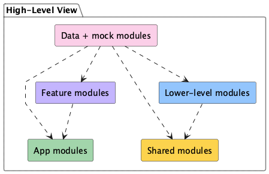
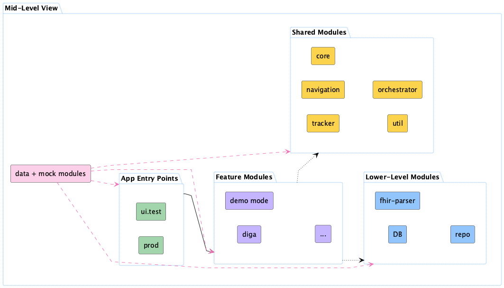
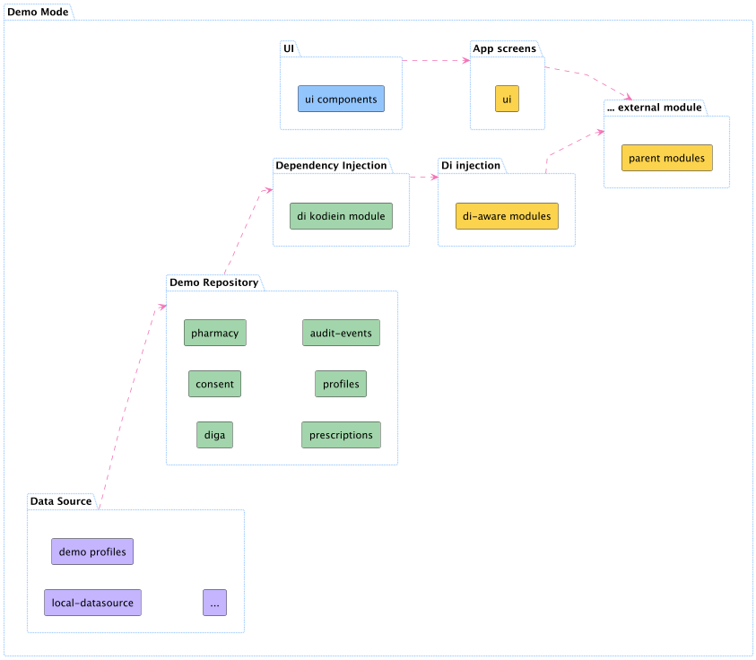
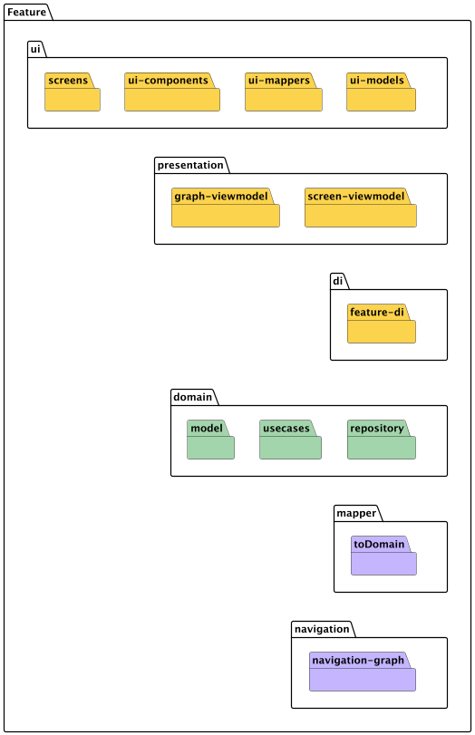

## 5.0 Building Block View <!-- {docsify-ignore} -->

This section presents the static decomposition of the **das e-Rezept** Android client into its constituent building blocks (modules, components, packages) and their relationships. It provides a top-down hierarchy that illustrates how the source code is organized and how modules depend on one another.

## 5.0 High-Level Overview

  
*Figure: High-Level Module View showing the top-level modules.*

| Box                   | Description                                                                        |
|-----------------------|------------------------------------------------------------------------------------|
| **App Modules**       | Android app entry points, including production and UI test modules.                |
| **Feature Modules**   | Encapsulate UI and domain logic for distinct application features.                 |
| **Shared Modules**    | Kotlin Multiplatform modules providing cross-cutting services like auth, navigation, logging. |
| **Lower-Level Modules** | Provide foundational libraries such as network client, persistence, and parsing utilities. |
| **Data + Mock Modules** | Offer stub implementations and static data for demo-mode and CI testing.        |

## 5.1 Building Block View (Level 2 - Mid-Level)

  
*Figure: Mid-Level Building Block View showing grouped modules.*

**App Modules**
- **prod**: Production APK entrypoint that initializes the feature orchestrator and core UI modules.
- **ui.test**: UI test APK configured to launch all modules under test conditions for end-to-end automation.

**Feature Modules**
- **diga**: Implements the DiGA flow, including UI screens, domain services, and usecase interactions.
- **prescription**: Implements the prescription flow, including UI screens, domain services, and usecase interactions for retrieval, management, sharing and submission.
- **pharmacy**: Implements the pharmacy flow for lookup, selection, favoriting, routing on maps.
- **message**: Implements local messaging, `GEM_ERP_PR_Communication_Disp_Request` on user redemption, `GEM_ERP_PR_Communication_Reply` and messaging history.
- **profile**: Implements user profile management, including personal data, settings, and preferences.
- **gid**: Implements the GID flow, including retrieval of the list of federal IDs, selection of the GID, logging in with the universal link.
- **onboarding**: Implements the onboarding flow, including user registration, authentication, and initial setup.
- **demo.mode**: Provides a demo mode for showcasing features without backend dependencies. All the repositories are mocked using static data here.

**Shared Modules**
- **app-core**: Core module providing essential services such as string resources, translations, error handling, shared business logic.
- **app-navigation**: Navigation module for managing deep links and navigation flows across the app. All routes are defined here. Screen graphs are defined here.
- **app-auth**: Authentication module for handling user authentication, including login, registration, and token management.
- **app-orchestrator**: Orchestrator module for managing the flow of data and interactions between different modules.

**Lower-Level Modules**
- **db**: Database module for managing local data storage and retrieval, including SQLite and Room database interactions.
- **logging**: Logging module for managing logs, including analytics and potential crash reporting.
- **network**: Network module for managing API calls, including Retrofit and Ktor configurations.
- **fhir-parser**: Parser module for handling FHIR and other data formats, including JSON parsing.
- **repo**: Repository module for managing data access and interactions with the database and network layers.

| Box                    | Description                                                                                                   |
|------------------------|---------------------------------------------------------------------------------------------------------------|
| **App Entry Points**   | Contains the production app (`prod`) and UI test app (`ui.test`) entry modules.                              |
| **Feature Modules**    | Encapsulate domain-specific UI and business logic (e.g. `diga`, `demo.mode`, `…`).                            |
| **Shared Modules**     | Kotlin Multiplatform modules providing cross-cutting services (core, orchestrator).                           |
| **Lower-Level Modules**| Foundational libraries for data access and parsing (`db`, `fhir-parser`, `logging`, `network`, `repo`).                    |
| **Data + Mock Modules**| Supplies mock repositories and static fixtures used in demo-mode and CI pipelines.                             |

## 5.2 Building Block View (Demo Mode) 
#### (Special Case)

  
*Figure: Demo Mode Building Block View showing module grouping*

#### Legend 

| Color | Description |
|-------|-------------|
|  `#FCD34D` | App screens, DI-aware modules and external modules (functional grouping) |
|  `#A2D5AB` | Demo repository modules (`diga`, `consent`, `pharmacy`, `prescriptions`, `profiles`, `audit-events`) |
|  `#C4B5FE` | Data source modules (`local-datasource`, `demo profiles`, …) |
|  `#93C5FD` | UI component modules |

### App Screens
- **ui**: Demo-specific UI components that render mock data for user flows.

### DI Injection
- **di-aware modules**: Modules configured for dependency injection of mock repositories and services.

### External Modules
- **parent modules**: Stand-in modules representing external dependencies in the mock environment.

### Demo Repository
- **diga**: Simulates the DiGA feature’s data layer with static responses.  
- **consent**: Mocks user consent storage and retrieval.  
- **pharmacy**: Emulates pharmacy lookup, selection, and routing data.  
- **prescriptions**: Provides static lists of prescription data and details.  
- **profiles**: Delivers predefined user profile constructs.  
- **audit-events**: Generates sample audit events for testing logging and analytics flows.

### Data Source
- **local-datasource**: In-memory or on-device storage for demo fixtures.  
- **demo profiles**: Preloaded static profile data.  
- **…**: Other fixture sources for additional features.

### Dependency Injection
- **di kodein module**: Declares Kodein bindings for all demo-mode modules, wiring mock implementations into the graph.

### UI Components
- **ui components**: Shared widgets and layout primitives used across all demo screens.

## 5.2 Building Block View (Feature Module)

  
*Figure: Feature Module Building Block View showing folder-style packages and their contents.*

## Legend

| Color | Description |
|-------|-------------|
|  `#FCD34D` | UI and DI packages (`ui`, `presentation`, `di`) |
|  `#A2D5AB` | Domain packages (`model`, `usecases`, `repository`) |
|  `#C4B5FE` | Mapper & navigation packages (`toDomain`, `navigation-graph`) |

### UI
- **screens**: Contains individual feature screen implementations.  
- **ui-components**: Shared widgets and view components used across the feature.  
- **ui-mappers**: Adapters that convert domain models into UI models.  
- **ui-models**: View-specific data classes and state holders.

### Presentation
- **graph-viewmodel**: Manages navigation graph state and cross-screen coordination.  
- **screen-viewmodel**: Encapsulates ViewModel logic for each screen in the feature.

### DI
- **feature-di**: Defines Kodein module bindings for all feature components.

### Domain
- **model**: Domain entities and data structures representing business concepts.  
- **usecases**: Business logic interactors executing feature workflows.  
- **repository**: Interfaces and implementations for data access (network, cache).

### Mapper
- **toDomain**: Conversion utilities mapping raw or external data into domain model objects.

### Navigation
- **navigation**: XML or code definitions of navigation routes and deep links for this feature.