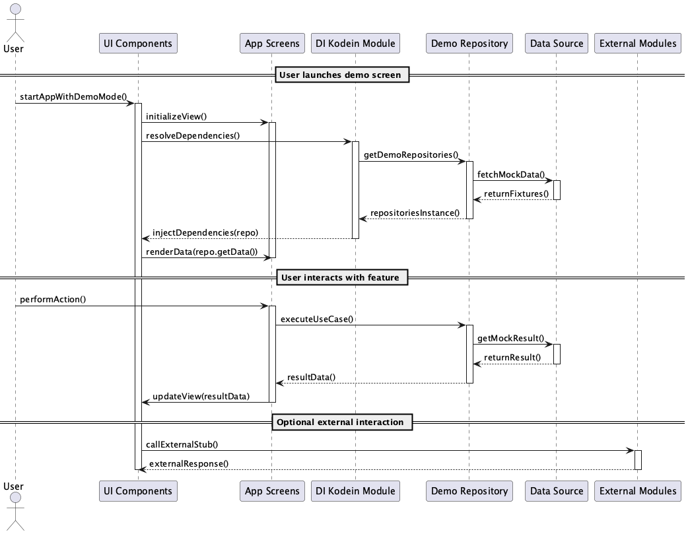
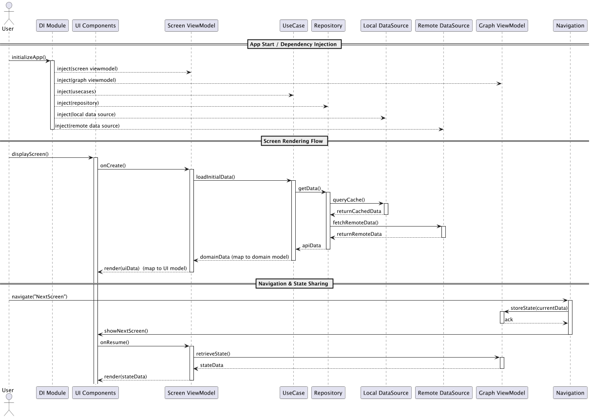
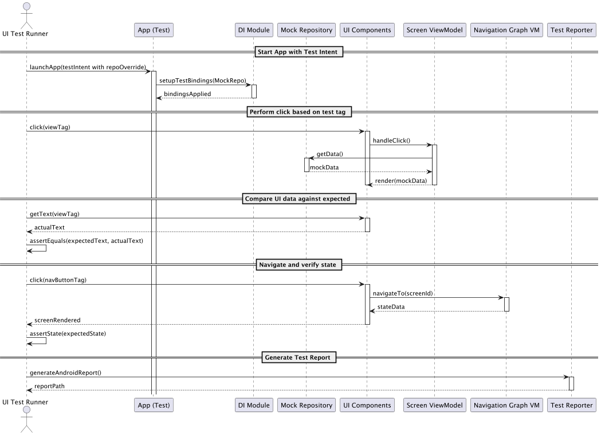

# 6 – Runtime View

This section describes the dynamic behavior of the das e-Rezept Android client through three key scenarios, each illustrated by its PlantUML sequence diagram.

## 6.1 Demo Mode Sequence

  
*Figure: Demo mode Module Runtime View showing the dynamic behavior of the app.*

1. **User launches the demo screen** in the app.  
2. **UI Components** receive the `startAppWithDemoMode()` call and initialize the app in demo mode.  
3. **UI Components** request dependencies from the **DI Kodein Module**.  
4. **DI Module** resolves and injects the **Demo Repository**.  
5. **Demo Repository** fetches static fixtures from the **Data Source**.  
6. **Data Source** returns mock data fixtures to the repository.  
7. **Demo Repository** returns the repository instance to the **DI Module**, which completes injection into the **UI Components**.  
8. **UI Components** render the mock data on the screen via the **App Screens** module.  
9. **User interactions** (e.g., clicks) trigger further calls into the **Demo Repository**, repeating the fetch and render cycle.  
10. **UI Components** may call **External Modules** stubs to simulate interactions.  

## 6.2 Feature Module Sequence

  
*Figure: Feature Module Runtime View showing the dynamic behavior of the app.*

1. **App Start**: **DI Module** initializes and injects:  
   - **Screen ViewModel**  
   - **Graph ViewModel**  
   - **UseCases**  
   - **Repository**  
   - **Local DataSource** and **Remote DataSource**   
2. **User opens a feature screen**; **UI Components** invoke `Content()` composable on the **Screen object**.  
3. **Screen ViewModel** calls a **UseCase** to `loadInitialData...()` into a flow which is observed on the screen.  
4. **UseCase** requests data from the **Repository**.  
5. **Repository** queries the **Local DataSource** for cached data.  
6. **Local DataSource** returns cached data (if present) from an encrypted database.  
7. **Repository** fetches fresh data from the **Remote DataSource**.  
8. **Remote DataSource** returns remote data to the **Repository**.  
9. **Repository** returns combined data to the **UseCase** after mapping it to a domain model.  
10. **UseCase** returns the data to the **Screen ViewModel**.  
11. **Screen ViewModel** updates the **UI Components** by updating the flows using refresh triggers and maps it to ui model.  
12. **Screen ViewModel** handles any errors by updating the UI with error states if data loading fails.  
13. **Screen Content** uses `navController` to trigger navigation events.  
14. **Navigation** module calls **Graph ViewModel** to store current state when it is shared between many screens.  
15. **Navigation** switches to the next screen, and **Screen ViewModel** retrieves state from **Graph ViewModel**.  

## 6.3 UI-Test Module Sequence

  
*Figure: Ui Test Module Runtime View showing the dynamic behavior of the app.*

1. **UI Test Runner** launches the app with a `testIntent` that overrides the repository.  
2. **App** starts and calls the **DI Module** to set up test bindings, replacing real repositories with **Mock Repository** similar to demo-mode.  
3. **Test Runner** simulates a **click** on a view identified by a test tag.  
4. **UI Components** handle the click and invoke the **Screen ViewModel**.  
5. **Screen ViewModel** requests data from the **Mock Repository** similar to demo-mode.  
6. **Mock Repository** returns pre-defined mock data.  
7. **Screen ViewModel** renders the mock data via **UI Components**.  
8. **Test Runner** retrieves text or state from **UI Components** and asserts it matches expected values.   
9. **Test Runner** asserts that the new screen’s state matches the expected state.  
10. **Test Runner** invokes the Android **Test Reporter** to generate and save the test report.  