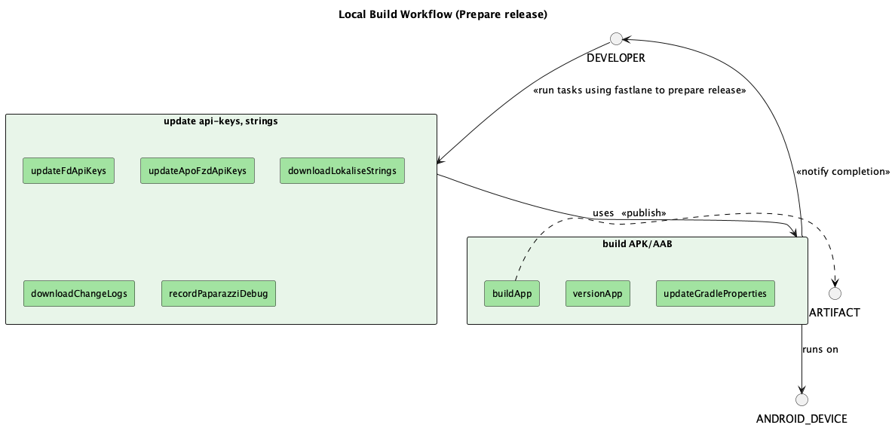
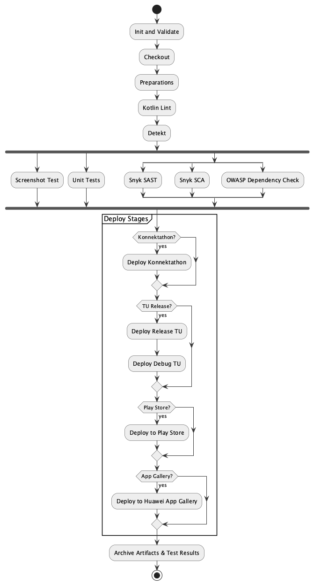

# 7 – Deployment View

This section describes how the das e-Rezept Android application modules are packaged, assembled, and delivered through the Gradle build system and script plugins.

## 7.1 Modules & Artifacts

- **App Modules**:
  - `app` (Production APK)
  - `ui-test` (Test APK for end-to-end UI automation)
- **AAR Modules** (Android libraries)
- **Pure Java Modules** (JAR libraries)
- **Kotlin Multiplatform (KMP) Modules**

All modules produce the following artifact types:

| Module Type          | Artifact            |
|----------------------|---------------------|
| Android Application  | `.apk`              |
| Android Library      | `.aar`              |
| Java Library         | `.jar`              |
| KMP Library          | `.klib` / `.jar`    |

## 7.2 Version & Dependency Management

- **Version Catalog (`libs.versions.toml`)**: Centralizes all dependency versions and plugin coordinates.  
- **`settings.gradle.kts`**: Includes module paths (`:app`, `:ui-test`, `:feature:*`, `:shared:*`, `:domain:*`, etc.).

## 7.3 Precompiled Script Plugins

All common Gradle logic is defined in the `scripts/` module and exposed via precompiled script plugins (Kotlin DSL):

| Plugin Script                              | Purpose                                                                       |
|--------------------------------------------|-------------------------------------------------------------------------------|
| `base-android-application.gradle.kts`      | Configures an Android app module (applies `com.android.application`, sets required plugins, `build flavours`, `licenseReport`, `versioning`, `packaging`, `dependencies`). |
| `base-android-library.gradle.kts`          | Configures an Android library module (applies `com.android.library`, sets `licenseReport`, `build flavours`, `dependencyCheck`, `dependencies`, `testReport`).            |
| `base-multiplatform-library.gradle.kts`    | Configures a Kotlin Multiplatform module (targets JVM, Android).   |
| `compose-convention.gradle.kts`            | Applies Jetpack Compose settings (compose compiler, UI tooling, Material3).  |
| `quality-detekt.gradle.kts`                | Applies Detekt linting rules and formatting checks.                           |

### 7.3.1 Example: Using the base-android-application.gradle.kts

```kotlin

plugins {
    id("base-android-application")
    id("de.gematik.ti.erp.dependency-overrides")
    id("de.gematik.ti.erp.names")
    alias(libs.plugins.compose.compiler)
}

android {
    namespace = gematik.appNameSpace
    defaultConfig {
        applicationId = gematik.appId
        versionCode = VERSION_CODE.toInt()
        versionName = VERSION_NAME
    }
}
```

### 7.3.2 Example: Using the base-android-library.gradle.kts

```kotlin

plugins {
    id("base-android-library")
    id("de.gematik.ti.erp.names")
    alias(libs.plugins.compose.compiler)
}

val namesPlugin = AppDependencyNamesPlugin()

android {
    namespace = namesPlugin.moduleName("feature")
    defaultConfig {
        testApplicationId = namesPlugin.moduleName("feature.test")
    }
}

dependencies {
    implementation(project(namesPlugin.utils))
    implementation(project(namesPlugin.fhirParser))
    implementation(project(namesPlugin.core))
    implementation(project(namesPlugin.navigation))
    implementation(project(namesPlugin.testTags))
    implementation(project(namesPlugin.multiplatform))
    implementation(project(namesPlugin.uiComponents))
    implementation(libs.bundles.animation)
}
```

## 7.4 BuildSrc Custom Tasks

All of these tasks live under the `buildSrc` folder and encapsulate common build-and-release steps:

```text
• versionApp               – Bump versionCode & versionName   
• updateGradleProperties   – Update `gradle.properties` with new version or keys  
• generateSchemaMigrationsFile – Generate DB schema migration file  

• downloadLokaliseStrings  – Fetch i18n strings from Lokalise  
• uploadLokaliseStrings    – Push updated strings back to Lokalise  
• downloadChangeLogs       – Fetch changelog entries from backend service  

• buildTuDebugApp          – Assemble the TU debug APK  
• buildKonnyApp            – Assemble the Konny flavor APK  
• buildTuReleaseApp        – Assemble the TU release APK  
• buildPlayStoreApp        – Produce Play-Store–ready APK  
• buildAppGalleryApp       – Produce Huawei-App-Gallery–ready APK  
• buildMockApp             – Assemble the UI‐test “mock” APK  
• buildMinifiedApp         – Assemble the minified debug APK  
• buildMinifiedKonnyApp    – Assemble the minified Konny APK  

• buildPlayStoreBundle     – Produce Play-Store AAB  
• buildAppGalleryBundle    – Produce App-Gallery AAB  

• updateApoFzdApiKeys      – Refresh APO-FZD API keys in code  
• updateFdApiKeys          – Refresh Fachdienst API keys in code  

• sendTeamsNotification    – Send build/deploy status to Microsoft Teams   
```

## 7.5 Deployment

## 7.5.1 Release Preparation
  
*Figure: Release preparations showing the steps to prepare the code for deployment.*

- **Update Version code**: Update `updateFdApiKeys` and `versionName` in `gradle.properties` using the `versionApp` task.
- **Update API Keys**: Update `updateFdApiKeys` and `updateApoFzdApiKeys` tasks to refresh API keys in the code.
- **Update Lokalise Strings**: Use `downloadLokaliseStrings` to fetch the latest strings from Lokalise.
- **Update Change Logs**: Use `downloadChangeLogs` to fetch the latest changelog entries from the backend service.
- **Build APKs**: Use `buildPlayStoreApp`, `buildAppGalleryApp`, and `buildMockApp` to produce the respective APKs.
- **Build AABs**: Use `buildPlayStoreBundle` and `buildAppGalleryBundle` to produce the respective AABs.
- **Fastlane**: Use Fastlane to automate all the steps above excluding the `build***App` task using a single lane.

 ## 7.5.2 Release Deployment
   
*Figure: Release deployment showing the steps to deploy the application to production.*

- **Init & Validate**: Parameters and credentials are checked.
- **Static Analysis**: run Kotlin Lint and Detekt.
- **Tests**: in parallel, run screenshot tests, unit tests, Snyk SAST/SCA, OWASP Dependency Check.
- **Build & Publish**: 
    - Execute `buildApp` tasks for each flavor and platform.
    - Publish artifacts to nexus.
    - **Publish to Play Store**: Use Fastlane to automate the submission of the APK/AAB to the Play Store.
    - **Publish to App Gallery**: Use Fastlane to automate the submission of the APK/AAB to the App Gallery.
 - **Notification**: Send a notification to Microsoft Teams with the build status.       
