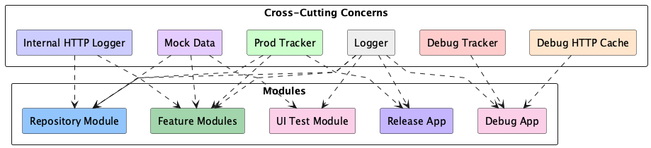

## 8 – Cross‐cutting Concepts <!-- {docsify-ignore} -->

  
*Figure: Cross cutting concerns showing the various modules it affects.*

Cross‐cutting concerns applied throughout the das e-Rezept client, independent of any single feature or module.

## 8.1 Logging & Tracking
- **Debug Tracker**  
  - A lightweight tracker module included only in `debug` builds.  
  - Injected into all modules (UI, Domain, Repository) to record user events and flows during development and QA.  
- **Production Tracker**  
  - Full-featured analytics/tracking library used in release builds.  
  - Is initialized only after the user has given the required consent. 
- **Application Logger**  
  - Centralized logging framework (e.g., Napier) configured via the base-application plugin.  
  - Provides consistent log formatting and log level control across every module.

## 8.2 HTTP Logging
- **Internal HTTP Logger**  
  - An OkHttp interceptor registered in all builds.  
  - Streams HTTP requests and responses to the in-app debug menu for real-time inspection.  
- **Debug HTTP Cache**  
  - Additional HTTP-logging library `chucker` included only in `debug` builds.  
  - Persists HTTP logs into a local database (Room) for offline analysis and retention.

## 8.3 Mock Data & Test Fixtures
- **Mock Data Module** (`data-mock`)  
  - Contains in-memory repository implementations and static JSON fixtures.  
  - Used by:  
    - **Unit Tests** (MockRepository)  
    - **Screenshot Tests** (Paparazzi)  
    - **Demo-mode Feature Modules**  
    - **Repository Module** (for offline/demo scenarios)  
  - Ensures consistent, repeatable test data and decouples tests from real backend dependencies.